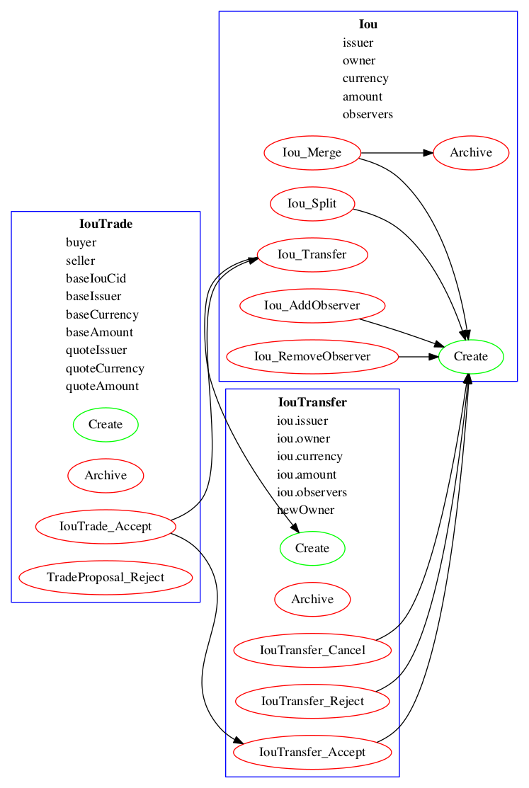
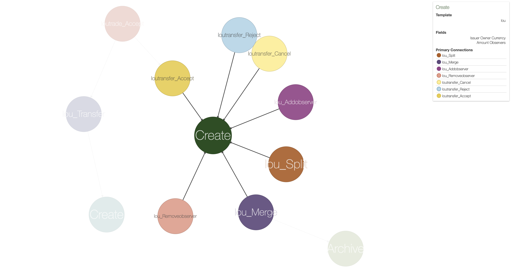

.. Copyright (c) 2022 Digital Asset (Switzerland) GmbH and/or its affiliates. All rights reserved.
.. SPDX-License-Identifier: Apache-2.0

Visualizing Daml Contracts
##########################

Visualizing Daml Contracts is currently an :doc:`Early Access Feature in Labs status </support/status-definitions>`.

You can generate visual graphs for the contracts in your Daml project. To do this:

1. Install `Graphviz <http://www.graphviz.org/download/>`_.
2. Open a terminal and navigate to your project root directory.
3. Generate a DAR from your project by running ``daml build -o project.dar``.
4. Generate a `dot file <https://en.wikipedia.org/wiki/DOT_(graph_description_language)>`_ from that DAR by running ``daml damlc visual project.dar --dot project.dot``
5. Generate the visual graph with Graphviz by running ``dot -Tpng project.dot > project.png``

You can of course choose different names for the files, as long as you're consistent between file creation and point of use.

Example: Visualize the Quickstart Project
=========================================

Here's an example visualization based on the :doc:`quickstart </app-dev/bindings-java/quickstart>`. You'll need to `install Graphviz <http://www.graphviz.org/download/>`_ to try this out.

1. Generate the dar using ``daml build``
2. Generate a dot file ``daml damlc visual dist/quickstart-0.0.1.dar --dot quickstart.dot``
3. Generate the visual graph with Graphviz by running ``dot -Tpng quickstart.dot -o quickstart.png``

Running the above should produce an image which looks something like this:

Visualize Daml Contracts - Within IDE
=====================================

You can generate visual graphs from VS Code IDE. Open the daml project in VS Code and use `command palette <https://code.visualstudio.com/docs/getstarted/tips-and-tricks#_command-palette/>`_. Should reveal a new window pane with dot image. Also visual generates only the currently open daml file and its imports.

Note: You will need to install the Graphviz/dot packages as mentioned above.

Visualize Daml Contracts - Interactive Graphs
=============================================

This does not require any packages installed. You can generate `D3 <https://d3js.org/>`_ graphs for the contracts in your Daml project. To do this

  1. Generate a DAR from your project by running ``daml build``
  2. Generate HTML file ``daml damlc visual-web .daml/dist/quickstart-0.0.1.dar -o quickstart.html``

Running the above should produce an image which looks something like this:

