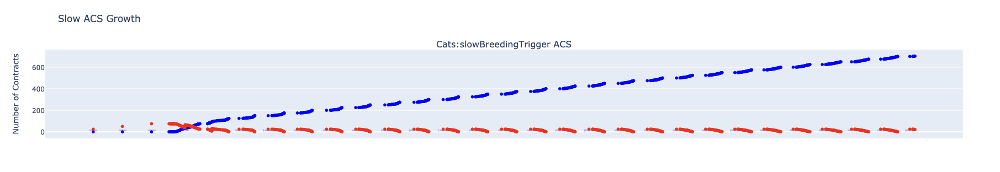
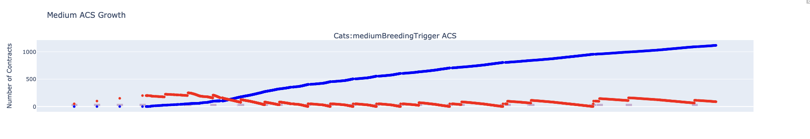
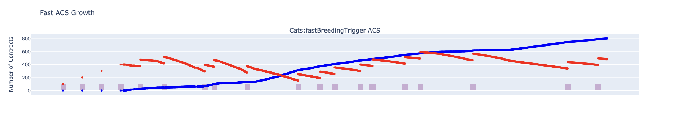
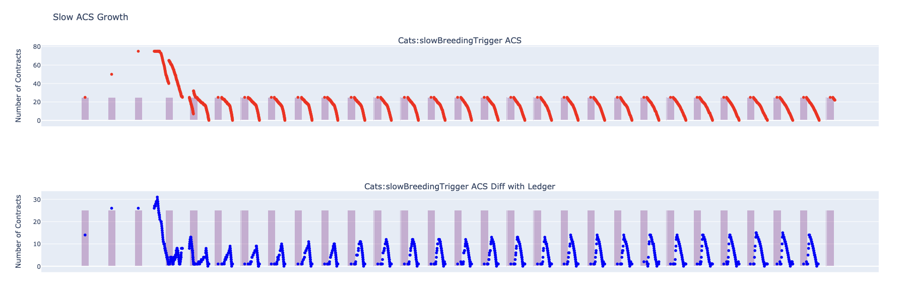
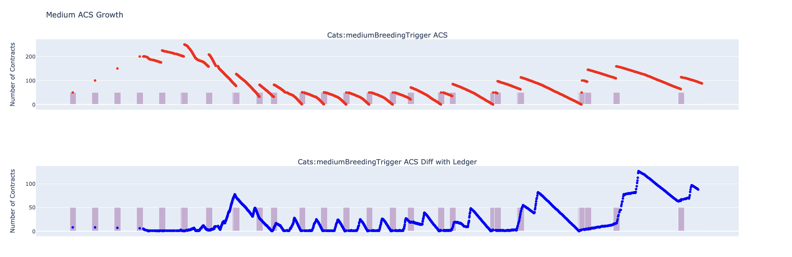
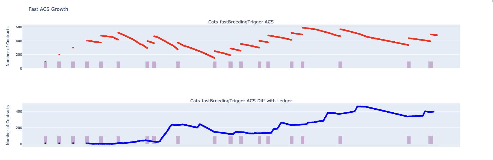
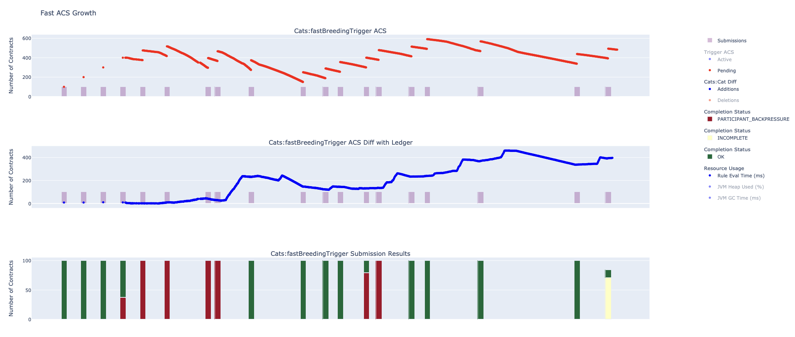
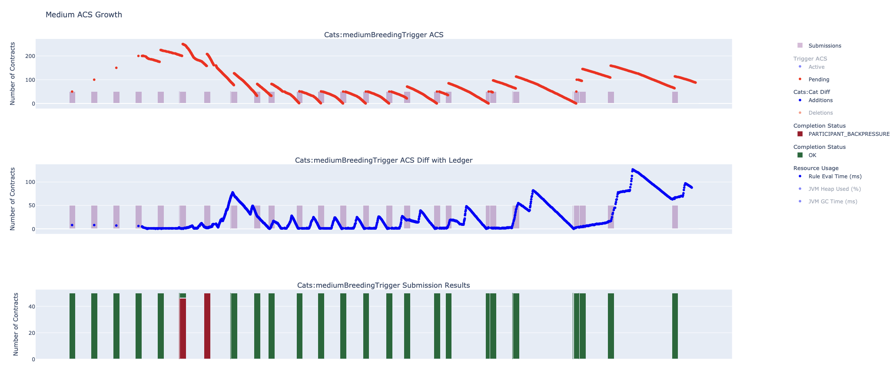

.. Copyright (c) 2023 Digital Asset (Switzerland) GmbH and/or its affiliates. All rights reserved.
.. SPDX-License-Identifier: Apache-2.0

Simulation Use Case Example: Impact of Uncontrolled ACS Growth
==============================================================

As triggers maintain an in-memory copy of the Ledger's active contract store (ACS), it is important that this data structure respects the triggers finite resource limits and its contents remain *relevant*.

In the following use-case simulations, we shall:

- explore some impacts in allowing the trigger ACS to have uncontrolled growth
- and demonstrate how ACS growth may be controlled by configuring hard limits.

This use-case assumes that the :doc:`development instructions <development.rst>` have been followed to setup your development and simulation environment.

.. note::
  By default, we use the open source version of Canton in our Scalatest based simulations. This version of Canton performs:

  - sequential transaction processing
  - and, due to some hard coded resource limits, is more likely to rate limit ledger command submissions.

  The enterprise version of Canton does not have these limitations.

Our simulation use-cases will use the Daml ``Cat`` template:

.. code-block:: unused
  template Cat
    with
      owner : Party
      name : Int
    where
      signatory owner

and, at some configurable creation rate, we will use Daml triggers to create multiple instances of this contract every second.

.. note::
  We can view ledger API command submissions (arriving at some pre-configured rate) as being queued and Canton as servicing those messages (at some pre-configured service rate).

  If service capacity is larger than the expected rate of message arrivals, then we can expect this *queuing system* to reach a steady state. However, if this is not the case, then we can expect this *queuing system* to keep growing (i.e. to eventually crash due to unbounded resource growth).

  Hence, it is important to ensure that Canton provisioning is able to cope with the expected trigger load.

The Scala simulation code is defined in :doc:`ACSGrowth.scala <scala/ACSGrowth.scala>`.

Impact of Uncontrolled ACS Growth
---------------------------------

At runtime, triggers process two types of workload:

- they evaluate user defined Daml code - we will refer to this as user processing or the user workload
- and they process completion and transaction events - we will refer to this as internal processing or the internal workload

  - completion events are processed as part of managing asynchronous ledger API command submissions
  - and transaction events (i.e. create and archive events) are processed to ensure that the internal trigger ACS view remains in-sync with the ledger ACS view.

.. note::
  To aid debugging trigger code, it is often helpful to ensure that these 2 types of workloads (i.e. user and internal) are separated - that way a developer may better detect issues with user vs internal trigger processing. For this use case we achieve this by ensuring that all user processing occurs only as a result of ``Heartbeat`` messages.

Allowing the trigger ACS to become large risks:

- increasing the time to perform user processing, as user code might query the ACS
- delaying when user processing occurs, as internal processing starts to become the dominant workload
- and increasing trigger ACS update latency.

Using a series of trigger simulations, we will show how these performance issues might manifest.

Running Trigger Simulations and Analysing Data
^^^^^^^^^^^^^^^^^^^^^^^^^^^^^^^^^^^^^^^^^^^^^^

In order to explore the impact that unconstrained ACS growth has upon a trigger, we shall run and analyse the data from 3 trigger simulations as follows:

.. code-block:: bash
  for NAME in Slow Medium Fast; do
    SIMULATION="${NAME}ACSGrowth"
    TITLE="${NAME} ACS Growth"
    bazel test \
      --test_env=DAR="$(pwd)/daml/.daml/dist/trigger-simulations-0.0.1.dar" \
      --test_output=streamed \
      --cache_test_results=no \
      --test_tmpdir=/tmp/ \
      --test_filter="com.daml.lf.engine.trigger.$SIMULATION" \
      //triggers/simulations:trigger-simulation-test-launcher_test_suite_scala_ACSGrowth.scala
    python3 ./data/analysis/graph-simulation-data.py --title "$TITLE" /tmp/_tmp/*/TriggerSimulation*/
  done

This code runs individual Scalatests in the file ``ACSGrowth.scala``. Each of these Scalatests describe a simulation where a trigger creates a fixed number of ``Cat`` contracts every second:

- the ``SlowACSGrowth`` simulation creates 25 contracts every second
- the ``MediumACSGrowth`` simulation creates 50 contracts every second
- and the ``FastACSGrowth`` simulation creates 100 contracts every second.

The generated simulation CSV data is then visualised using some Plotly code. Logging data from these simulations will generally not be required in our analysis of these use cases.

Analysing ACS Growth
^^^^^^^^^^^^^^^^^^^^

Active Contracts
~~~~~~~~~~~~~~~~

  Slow ACS Growth: Active Contracts

  Medium ACS Growth: Active Contracts

  Fast ACS Growth: Active Contracts

In all 3 graphs, the number of active contracts (in blue) grows incrementally as the simulation runs, and this is to be expected. Notice though, that:

- for the ``SlowACSGrowth`` simulation, around 700 contracts are actually created, with a theoretical maximum of 750 contracts (= 25 * 30) being possible

  - i.e. 93.3% (= 100 * 700 / 750) of possible contracts are actually created

- for the ``MediumACSGrowth`` simulation, around 1100 contracts are actually created, with a theoretical maximum of 1500 contracts (= 50 * 30) being possible

  - i.e. 73.3% (= 100 * 1100 / 1500) of possible contracts are actually created

- and for the ``FastACSGrowth`` simulation, around 635 contracts are actually created, with a theoretical maximum of 3000 contracts (= 100 * 30) being possible

  - i.e. 21.2% (= 100 * 635 / 3000) of possible contracts are actually created.

So, as the rate at which we create contracts increases, the triggers ability to create contracts (c.f. its efficiency) is dropping.

.. note::
  Triggers have a configurable **hard limit** (``maximumActiveContracts``) on the number of active contracts that they may store. If this hard limit is exceeded by a trigger, then it will be stopped with a ``ACSOverflowException`` exception.

Pending Contracts and Submissions
~~~~~~~~~~~~~~~~~~~~~~~~~~~~~~~~~

  Slow ACS Growth: Pending Contracts and Ledger Diff

  Medium ACS Growth: Pending Contracts and Ledger Diff

  Fast ACS Growth: Pending Contracts and Ledger Diff

For each ACS graph, we filter out the the active contracts and the completion status, then examine the relationship between the pending contracts (in red) and the number of command submissions (in purple/lavender).

Pending contracts represent submission requests (to create a ``Cat`` contract) that have been issued to the ledger. As the ledger creates these contracts, it will then issue create contract events, and these in turn will cause contracts to move from a pending state into an active state.

The breeding triggers have been defined so that they:

- only perform the user workload whenever a heartbeat message is received

  - as the user workload always produces command submissions, and so non-zero submission counts indicate that the user workload has completed

- and for all zero submission plots, the internal workload is running

  - this relationship can be clearly seen on these graphs as the pending counts drop between non-zero submission plots
  - and completion failures are all processed between non-zero submission plots.

Notice that the time between processing user workloads (i.e. between non-zero submission plots) is dependent on the time spent processing the internal workload (i.e. the number of pending contracts that are processed). Specifically, we have that:

- for the ``SlowACSGrowth`` simulation, user workloads are actually ran every second and there is no detectable delay in processing internal workloads
- for the ``MediumACSGrowth`` simulation, some internal workloads are delayed when user workloads run
- and for the ``FastACSGrowth`` simulation, internal workloads are starting to dominate the triggers processing time with user workloads often delayed.

When we look at how pending contract counts trend:

- for the ``SlowACSGrowth`` simulation, pending contract counts are bounded
- for the ``MediumACSGrowth`` simulation, there is some small growth in pending counts for the latter half of the simulation

  - the expectation is that if we run the trigger simulation for longer than 30 seconds, then this growth should continue

- and for the ``FastACSGrowth`` simulation, pending counts are growing as the simulation proceeds.

.. note::
  In order to ensure that triggers can scale (as the number of contracts they need to process increases), we need to ensure that user and internal workloads are *balanced*.

  Triggers have a configurable **hard limit** (``inFlightCommandOverflowCount``) on the number of on-flight commands that they can have. If this hard limit is exceeded by a trigger, then it will be stopped with a ``InFlightCommandOverflowException`` exception.

Analysing ACS Relevance
^^^^^^^^^^^^^^^^^^^^^^^

If a triggers ACS view deviates too far from the ledgers ACS view, then triggers will use stale or invalid contract data during user processing. So, an important trigger design goal is to ensure that its ACS remains *relevant*.

Trigger ACS *relevancy* can be measured by comparing the contracts that the trigger knows about to the contracts that the ledger knows about. Trigger simulations perform such a difference at the end of each rule evaluation cycle. This information is plotted on the *ACS Diff with Ledger* graphs:

- with contract additions (in blue) measuring how many active contracts the ledger has created, but the trigger has yet to observe the creation event
- and with contract deletions (in red) measuring how many active contracts the ledger has archived, but the trigger has yet to observe the archive event.

As our ACS growth simulations are only creating contracts, we can filter out the contract deletions for each of our diff graphs.

Now, as we examine our ACS difference graphs, notice that:

- for the ``SlowACSGrowth`` simulation, contract additions are bounded and display a clear *raster* pattern

  - in other words, Canton service provisioning is able to manage the workload that our triggers generate

- and for the ``MediumACSGrowth`` and ``FastACSGrowth`` simulations, contract additions start to increase in the latter stages of the simulation run

  - also notice that as the trigger ACS view diverges from the ledger ACS view, the number of pending contracts also starts to grow
  - or, in other words, Canton service provisioning is unable to manage the workload that our triggers generate.

.. note::
  In order to ensure that triggers can scale (as the number of contracts they need to process increases), we need to ensure that the trigger ACS remains *relevant* (i.e. divergence of the trigger ACS view from the ledger ACS view is **bounded**).

Analysing Completion Failures
^^^^^^^^^^^^^^^^^^^^^^^^^^^^^

  Fast ACS Growth: Pending Contracts, Ledger Diff and Completion Failures

As the ``SlowACSGrowth`` simulation handles no completion failures, we drop this simulation from our analysis in this section.

Triggers typically manage completion failures as part of their internal workload. As a result, high rates of completion failures can contribute to delays in user workload processing.

When the ledger API receives too many submissions from a ledger client, it will immediately fail ledger API requests with a ``PARTICIPANT_BACKPRESSURE`` completion failure. For our simulations, the Canton participant is configured to back pressure when it receives more than 100 submissions within a 1 second time window.

  Medium ACS Growth: Pending Contracts, Ledger Diff and Completion Failures

Notice that for the ``MediumACSGrowth`` simulation, completion failures briefly occur at the simulations start. This is because at the start of this simulation, internal workloads incur little to no overhead, and so there is little delay to when user workloads run. Hence, there is a greater probability that subsequent user workloads (which each generate 50 command submissions) will both occur within a 1 second time window and so trip the participant back pressure alarms. Once the ledger is regularly processing contract creations, the internal workloads increase in duration reducing the probability of back pressure alarms being tripped.

For the ``FastACSGrowth`` simulation, each user workload will generate 100 distinct command submissions and so there is a high probability that user workloads will trip the Participant back pressure alarms. Each submission failure results in a completion failure that is processed sometime after the initial ledger client request has failed.

.. note::
  Trigger simulations use a ledger API client that does not perform any retries of submissions when client requests **immediately** fail (e.g. due to back pressure). Actual trigger implementations will typically retry such failing requests up to 6 times (with exponential backoff, but **no** jitter). This is a known limitation of trigger simulations.

  Triggers use ``maxSubmissionRequests`` and ``maxSubmissionDuration`` to control the rate at which they submit commands to the ledger API. Triggers will internally back pressure (i.e. user and internal workloads will be delayed) when submission rates are exceeded.
