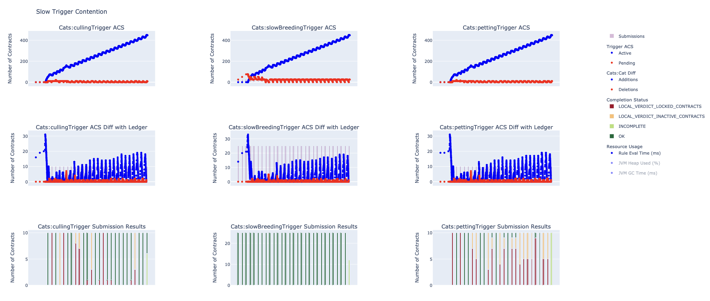
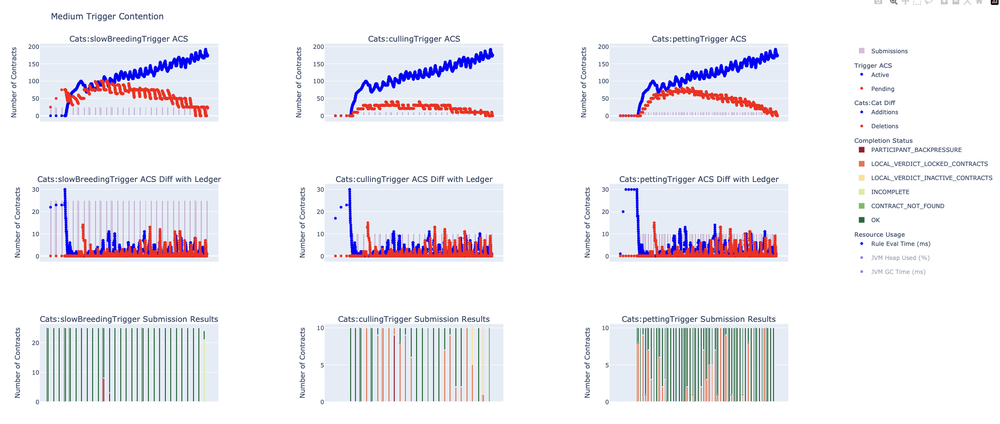
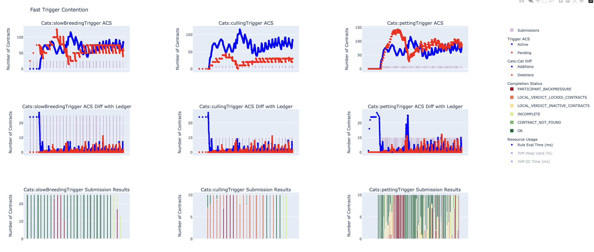
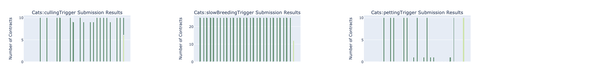
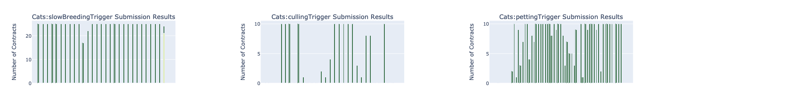
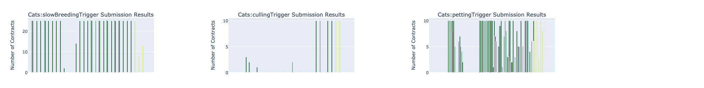
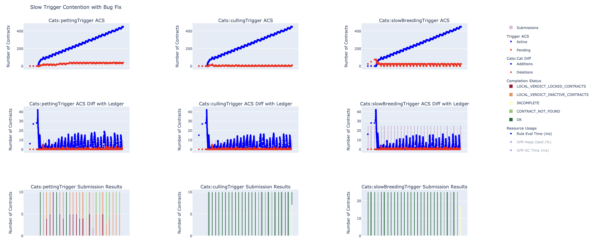
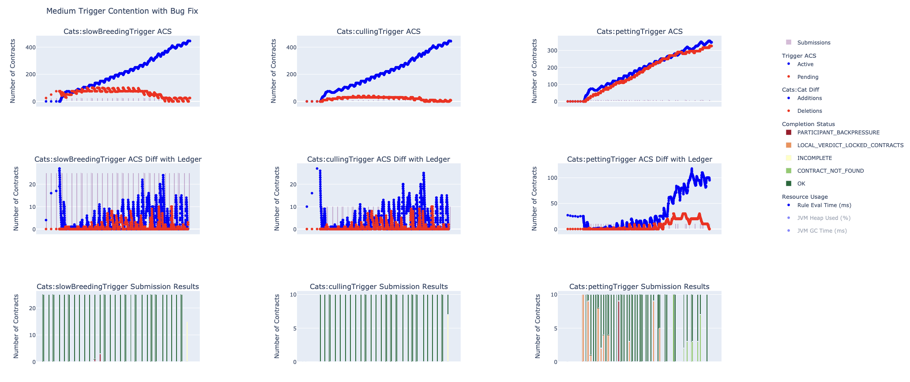
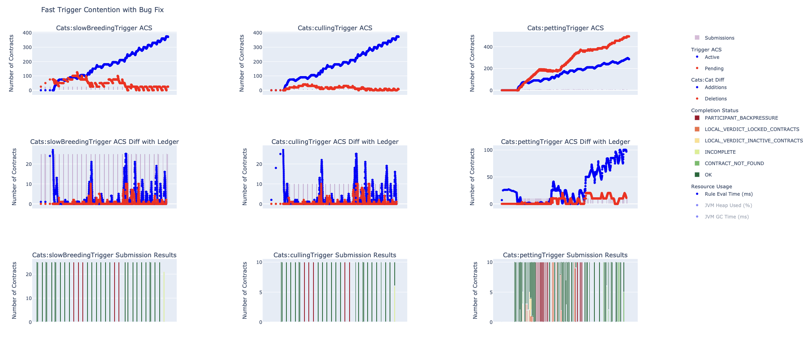

.. Copyright (c) 2024 Digital Asset (Switzerland) GmbH and/or its affiliates. All rights reserved.
.. SPDX-License-Identifier: Apache-2.0

Simulation Use Case Example: Impact of Uncontrolled Contention
==============================================================

Triggers, like any other code that uses a ledger API client, interact with the ledger asynchronously and the ledger *may* also process transactions concurrently, hence there is a high risk that multiple changes (e.g. exercises, archives, etc.) to the same contract might overlap each other. When this happens, contention is said to occur.

In the following use-case simulations we explore some of the consequences in not controlling contention.

This use-case assumes that the :doc:`development instructions <development.rst>` have been followed to setup your development and simulation environment.

.. note::
  By default, we use the open source version of Canton in our Scalatest based simulations. This version of Canton performs:

  - sequential transaction processing
  - and, due to some hard coded resource limits, is more likely to rate limit ledger command submissions.

  The enterprise version of Canton does not have these limitations.

Our simulation use-cases will use the Daml ``Cat`` template:

.. code-block:: unused
  template Cat
    with
      owner : Party
      name : Int
    where
      signatory owner

    choice Stroke_Cat : ()
      controller owner
      do
        pure ()

along with the following 3 triggers:

- a breeding trigger that will create contracts
- a culling trigger that will archive contracts
- and a petting trigger that will exercise the ``Stroke_Cat`` choice on contracts.

The culling and petting triggers are designed so that there is a high risk that they will interfere or contend with each other.

The Scala simulation code is defined in :doc:`Contention.scala <scala/Contention.scala>`.

Impact of Uncontrolled Contention
---------------------------------

As the ledger processes command submissions, it will potentially *lock* the contracts it is about to interact with. This allows triggers to detect `contention <https://docs.daml.com/canton/usermanual/troubleshooting_guide.html#contention>`_ as one of the following completion failure signals:

- LOCAL_VERDICT_LOCKED_CONTRACTS
- LOCAL_VERDICT_INACTIVE_CONTRACTS
- CONTRACT_NOT_FOUND

In addition, whenever ledger process command submissions use contract keys (which will reference contracts *indirectly*), then contract keys can also be potentially *locked*. Triggers can detect this type of contention as one of the following completion failure signals:

- LOCAL_VERDICT_LOCKED_KEYS
- LOCAL_VERDICT_DUPLICATE_KEY
- LOCAL_VERDICT_INCONSISTENT_KEY
- DUPLICATE_CONTRACT_KEY

If contention issues are not managed by your trigger definitions, then this can lead to:

- contract exercises taking longer than expected to run (due to a need to retry the command failure)
- contracts having longer than expected lifetimes (as archive commands might be delayed)
- and the triggers ACS becoming larger than expected over time.

When writing trigger Daml code, **it is the responsibility of the user to ensure that all potential ledger contention is avoided**.

.. note::
  Avoiding ledger contention means that we need to ensure that multiple contract interactions (e.g. creates, exercises, etc.) do not occur within overlapping time windows.

  A good source of strategies to achieve this is `Reducing Contention <https://docs.daml.com/2.7.0/daml/resource-management/contention-reducing.html>`_.

Running Trigger Simulations and Analysing Data
^^^^^^^^^^^^^^^^^^^^^^^^^^^^^^^^^^^^^^^^^^^^^^

In order to explore the impact that uncontrolled contention has upon a trigger, we shall run and analyse the data from 3 trigger simulations as follows:

.. code-block:: bash
  for NAME in Slow Medium Fast; do
    SIMULATION="${NAME}Contention"
    TITLE="${NAME} Trigger Contention"
    bazel test \
      --test_env=DAR="$(pwd)/daml/.daml/dist/trigger-simulations-0.0.1.dar" \
      --test_output=streamed \
      --cache_test_results=no \
      --test_tmpdir=/tmp/ \
      --test_filter="com.daml.lf.engine.trigger.$SIMULATION" \
      //triggers/simulations:trigger-simulation-test-launcher_test_suite_scala_Contention.scala
    python3 ./data/analysis/graph-simulation-data.py --title "$TITLE" /tmp/_tmp/*/TriggerSimulation*/
  done

This code runs individual Scalatests in the file ``Contention.scala``. Each of these Scalatests describe a simulation where:

- for the ``SlowContention`` simulation

  - the petting trigger exercises the ``Stroke_Cat`` choice on 10 contracts every second

- for the ``MediumContention`` simulation

  - the petting trigger exercises the ``Stroke_Cat`` choice on 10 contracts every 500 milliseconds - which is essentially 20 contracts every second

- and for the ``FastContention`` simulation

  - the petting trigger exercises the ``Stroke_Cat`` choice on 10 contracts every 250 milliseconds - which is essentially 40 contracts every second.

For all simulations:

- a breeding trigger creates 25 contracts every second
- and a culling trigger archives at most 10 contracts per second.

The generated simulation CSV data is then visualised using some Plotly code. Logging data from these simulations will generally not be required in our analysis of these use cases.

Detecting Contention
^^^^^^^^^^^^^^^^^^^^

As our simulations run, submission and completion information is collected and collated for each command. This allows us to graph not just the number of submissions that each trigger rule evaluation cycle generates, but to also plot:

- the completion success or failure for each command submission
- and the statistical summary for timings between submitting a command and receiving the commands completion.

This information is displayed on the *Submission Result* graphs with submission timing information being displayed when we hover over a given set of submissions. Being able to graph this information in a correlated manner allows contention to be clearly observed and tested for.

  Slow Trigger Contention: 10 exercises/s

  Medium Trigger Contention: 20 exercises/s

  Fast Trigger Contention: 40 exercises/s

Analysing Contention
^^^^^^^^^^^^^^^^^^^^

Active and Pending Contracts
~~~~~~~~~~~~~~~~~~~~~~~~~~~~

When we archive contracts at a lower rate than we create them, then we expect the number of active contracts to grow linearly over time. For each of our contention simulations, we observe the following:

- for the ``SlowContention`` and ``MediumContention`` simulations, the ACS active graphs look consistent with our expectations

  - however, the total number of active contracts is dropping between these simulations, which leads us to suspect that contention might be the cause here? Additional analysis will help us understand the reasons behind this.

- however, for the ``FastContention`` simulation, the ACS active graph is bounded

  - this suggests that we are archiving contracts at a rate greater than their creation, which is surprising as:

    - the rate of contract creation and archiving is consistent across all 3 simulations
    - we would expect increased contention to degrade the number of archives, not increase them!

So, something else is happening here that we do not currently understand.

ACS Relevance
~~~~~~~~~~~~~

For the ``MediumContention`` and ``FastContention`` simulations, the trigger ACSes all remain in good synchronisation with the ledgers ACS.

However, for the ``SlowContention`` simulation, if anything there appears to be a very slow divergence from the ledgers ACS view (we can observe an increasing trend in the number of ledger contracts that are unknown to each trigger).

Analysing Completion Failures
~~~~~~~~~~~~~~~~~~~~~~~~~~~~~

For all 3 simulations, contention (along with some backpressure which we will ignore) clearly occurs. As the rate at which we exercise choices increases, then the amount of contention between our culling and petting triggers (unsurprisingly) increases.

Consider now the following three graphs where we focus purely on the work done by successful command submissions:

  Slow Trigger Contention: 10 exercises/s

  Medium Trigger Contention: 20 exercises/s

  Fast Trigger Contention: 40 exercises/s

For the ``SlowContention`` simulation, we estimate that 18 of the 26 submission cycles produce a full cohort of 10 successful archives - i.e. 69% of expected archive commands complete successfully.

For the ``MediumContention`` simulation, we estimate that 13 of the 26 submission cycles produce a full cohort of 10 successful archives - i.e. 50% of expected archive commands complete successfully.

Finally, for the ``FastContention`` simulation, we estimate that 5 out of the 26 submission cycles produce a full cohort of 10 successful archives - i.e. 19% of expected archive commands complete successfully.

So, as we increase the rate at which we exercise contract choices, the contention rate is clearly increasing (as evidenced by our falling archive success rate). Now, recall that previously we looked at our active ACS graphs, we observed that archives are actually increasing!

So, despite the fact that contention is reducing the number of archive events, something else is contributing to their increase. Recall that Daml has a concept of `consuming and non-consuming choices <https://docs.daml.com/daml/reference/choices.html#contract-consumption>`_ and here, in our ``Cat`` template, we have used a consuming choice. As a result, each time we exercise the ``Stroke_Cat`` choice, we also issue an extra archive command. And it is this additional archiving effect that we are observing here!

We can fix this Daml bug by modifying our ``Cat`` templateto use a non-consuming choice as follows:

.. code-block:: unused
  template Cat
    with
      owner : Party
      name : Int
    where
      signatory owner

    nonconsuming choice Stroke_Cat : ()
      controller owner
      do
        pure ()

Having modified the Daml template, ensure you rebuild your Daml project with:

.. code-block:: unused
  daml damlc build --project-root ./daml

Having done this, we can re-run our corrected Daml code in our simulations with:

.. code-block:: bash
  for NAME in Slow Medium Fast; do
    SIMULATION="${NAME}Contention"
    TITLE="${NAME} Trigger Contention with Bug Fix"
    bazel test \
      --test_env=DAR="$(pwd)/daml/.daml/dist/trigger-simulations-0.0.1.dar" \
      --test_output=streamed \
      --cache_test_results=no \
      --test_tmpdir=/tmp/ \
      --test_filter="com.daml.lf.engine.trigger.$SIMULATION" \
      //triggers/simulations:trigger-simulation-test-launcher_test_suite_scala_Contention.scala
    python3 ./data/analysis/graph-simulation-data.py --title "$TITLE" /tmp/_tmp/*/TriggerSimulation*/
  done

  Slow Trigger Contention with Bug Fix: 10 exercises/s

  Medium Trigger Contention with Bug Fix: 20 exercises/s

  Fast Trigger Contention with Bug Fix: 40 exercises/s

Active and Pending Contracts
~~~~~~~~~~~~~~~~~~~~~~~~~~~~

Looking at our active ACS contracts, we observe a linear increase for all 3 triggers - which now matches our original expectations.

However, notice that:

- for the ``MediumContention`` simulation, pending ACS contracts increases at the same rate as the active ACS contracts for the petting trigger
- and for the ``FastContention`` simulation, pending ACS contracts is bounded (from below) by the active ACS contracts for the petting trigger.

Each pending ACS contract means there is an outstanding (i.e. uncompleted) command submission associated with that contract. So, when the number of pending ACS contracts grow linearly, then there is linear growth in the number of outstanding or uncompleted command submissions. Here, we suspect that the rate of petting trigger command submissions (each of which will be an exercise command) is greater than the rate at which the ledger can service these commands.

ACS Relevance
~~~~~~~~~~~~~

Comparing the petting trigger ACS view against the ledger ACS view, we notice that for both the ``MediumContention`` and ``FastContention`` simulations, the number of ledger contracts unknown to the trigger is increasing. This increasing ledger divergence is consistent with the view that the petting trigger is not managing to process contract create events from the ledger. This could be due to the petting trigger user workload dominating its internal workload? This view is supported by:

- the increasing time gaps between submission cycles (i.e. the purple/lavender bars) as the ledger ACS view deviates from the trigger ACS view
- and the linearly increasing number number of pending command submissions (with the context that there is a linear trend in contracts known to the ledger that are unknown to the trigger).

Analysing Completion Failures
~~~~~~~~~~~~~~~~~~~~~~~~~~~~~

With the revised Daml code, and for all 3 simulations, contention is now *only* observed with the petting trigger.
