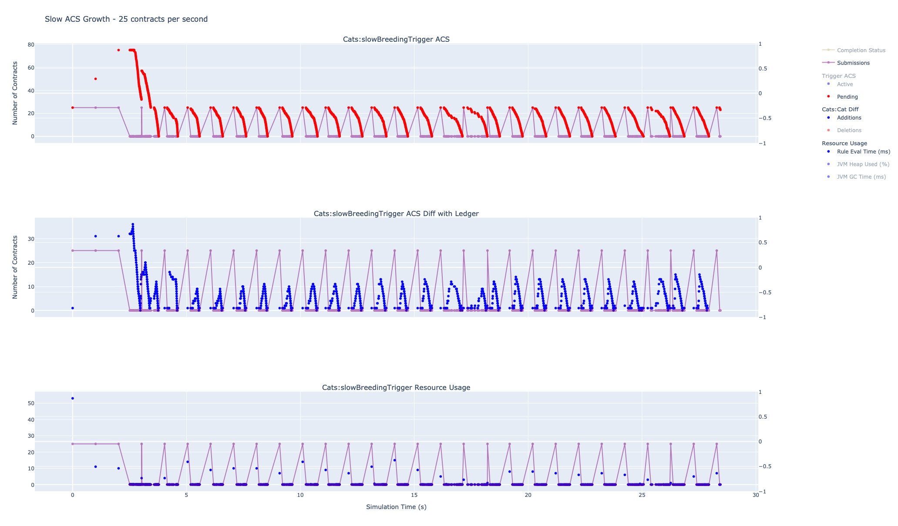
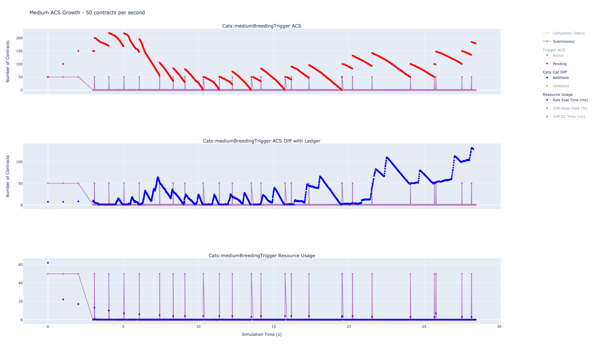

.. Copyright (c) 2023 Digital Asset (Switzerland) GmbH and/or its affiliates. All rights reserved.
.. SPDX-License-Identifier: Apache-2.0

Simulation Use Case Example: Impact of Uncontrolled ACS Growth
==============================================================

As triggers maintain an in-memory copy of the Ledger's active contract store (ACS), it is important that this data structure respects the triggers finite resource limits.

In the following use-case simulation, we shall:

- explore some impacts in allowing the trigger ACS to have uncontrolled growth
- and demonstrate how ACS growth may be controlled by configuring hard limits.

This use-case assumes that the :doc:`development instructions <development.rst>` have been followed to setup your development/simulation environment.

For this simulation use-case, we will use the Daml ``Cat`` contract:

.. code-block:: unused
  template Cat
    with
      owner : Party
      name : Int
    where
      signatory owner

and, at some configurable rate, have a Daml trigger create instances of this contract every second. Clearly, the rate at which this trigger creates ``Cat`` contracts will determine the rate at which the trigger's ACS grows and so consumes resources.

For this simulation, we will use the Scala simulation code defined in :doc:`ACSGrowth.scala <scala/ACSGrowth.scala>`.

Impact of Uncontrolled ACS Growth
---------------------------------

At runtime, triggers process two types of workload:

- they evaluate user defined Daml code - we will refer to this as user processing
- and they process completion and transaction events - we will refer to this as internal processing

  - completion events are processed as part of managing asynchronous ledger API command submissions
  - and transaction events (i.e. ledger contract create and archive events) are processed to ensure that the internal trigger ACS view remains in-sync with the ledger ACS view.

Querying the trigger ACS data structure has O(n) complexity - i.e. it is linear in the size of the trigger ACS. So, allowing the trigger ACS to become large risks:

- increasing the time to perform user processing, as user code might query the ACS
- delaying when user processing occurs, as internal processing starts to become the dominant workload
- and increasing trigger ACS update latency.

Using a series of trigger simulations, we show how each of these performance issues might manifest.

Slow ACS Growth
^^^^^^^^^^^^^^^

Let us start by running the ``SlowACSGrowth`` simulation for 30 seconds using:

.. code-block:: bash
  bazel test \
    --test_env=DAR=$(pwd)/daml/.daml/dist/trigger-simulations-0.0.1.dar \
    --test_output=streamed \
    --cache_test_results=no \
    --test_tmpdir=/tmp/ \
    --test_filter=com.daml.lf.engine.trigger.SlowACSGrowth \
    //triggers/simulations:trigger-simulation-test-launcher_test_suite_scala_ACSGrowth.scala

Here, we ensure that simulation CSV data is saved/persisted in the ``/tmp`` directory. After approximately 30 seconds (this is configured within the Scala simulation code), the ``SlowACSGrowth`` simulation should have completed successfully - i.e. you should observe that the Scalatest was green and there is a report that all tests passed.

On the console, we should see trigger logging from this simulation. For the moment, we shall not worry about this logging and will simply focus on the simulation CSV data saved under ``/tmp``. The saved CSV data consists of 2 files:

- one file (``trigger-simulation-metrics-data.csv``) containing trigger metric data
- and one file (``trigger-simulation-acs-data.csv``) containing information about how the trigger ACS view differs from the ledger ACS view.

This CSV data may be visualised with `Plotly <https://plotly.com>`_ using:

.. code-block:: bash
  python3 ./data/analysis/graph-simulation-data.py --title "Slow ACS Growth - 25 contracts per second" /tmp/_tmp/*/TriggerSimulation*/

.. note::
  - If our simulation had contained multiple triggers, then we would observe a column per trigger.
  - If our ACS had utilised multiple templates, then the ACS difference graphs would be broken down by template.

  ..

|

Analysing the "ACS" Graph
~~~~~~~~~~~~~~~~~~~~~~~~~

As we might expect, the number of active contracts grows linearly as the trigger simulation proceeds.

Also, as we might expect, the number of pending contracts drops from 25 contracts to 0 every second during its steady state. At all times, within the simulation, the number of pending contracts is bounded.

As the triggers have been configured to only produce command submissions on heartbeats, and these occur once every second, then non-zero submission plots indicate where trigger user code is running.

In between the processing of heartbeat messages, triggers spend their time (internally) processing ledger completion and transaction events. If triggers spend too much time processing these events, then processing of user code may be delayed.

For this simulation, we can observe that submissions (of 25 contracts) are occurring once every second, with little observable delay due to internal trigger processing. This is a preferred outcome.

.. note::
  Submissions are drawn using line and point markers to aid visualising their frequency.

Analysing the "ACS Diff with Ledger" Graph
~~~~~~~~~~~~~~~~~~~~~~~~~~~~~~~~~~~~~~~~~~

ACS diffs measure (on a per template basis):

- the number of contracts that need to be added to the trigger ACS
- and the number of contracts that need to be deleted from the trigger ACS

in order to match the current ledger ACS view.

Graphing this data allows engineers to determine the degree to which the triggers view of the ACS is deviating from the ledgers view of the ACS over time. As triggers issue command submissions to the ledger by querying their ACS, then when the trigger ACS deviates from the ledger ACS then there is a high risk that stale or invalid command submissions will be made.

As the breeding triggers only create contracts, the only potential deviations from the ledger ACS view are due to contracts the ledger knows about, but the trigger has yet to learn - hence the contract additions are the signal we need to analyse here.

Notice that when running user code (i.e. processing contract submissions), we have a bounded divergence. Between processing user code, we have a growth of unknown trigger contracts that then drops back down to zero, producing a stable raster type pattern.

Simulation Conclusions
~~~~~~~~~~~~~~~~~~~~~~

The trigger is able to manage processing ledger updates without impacting the processing of trigger user code - this is generally a desired goal.

The trigger ACS grows linearly over time and so risks exhausting the available trigger resources. Ultimately, this type of trend needs to be managed by the user.

Medium ACS Growth
^^^^^^^^^^^^^^^^^

Run the ``MediumACSGrowth`` simulation (under the bazel target ``trigger-simulation-test-launcher_test_suite_scala_ACSGrowth.scala``) using:

.. code-block:: bash
  bazel test \
    --test_env=DAR=$(pwd)/daml/.daml/dist/trigger-simulations-0.0.1.dar \
    --test_output=streamed \
    --cache_test_results=no \
    --test_tmpdir=/tmp/ \
    --test_filter=com.daml.lf.engine.trigger.MediumACSGrowth \
    //triggers/simulations:trigger-simulation-test-launcher_test_suite_scala_ACSGrowth.scala

Graph the results using:

.. code-block:: bash
  python3 ./data/analysis/graph-simulation-data.py --title "Medium ACS Growth - 50 contracts per second" /tmp/_tmp/*/TriggerSimulation*/

  ..

|

Analysing the "ACS" Graph
~~~~~~~~~~~~~~~~~~~~~~~~~

TODO:

Analysing the "ACS Diff with Ledger" Graph
~~~~~~~~~~~~~~~~~~~~~~~~~~~~~~~~~~~~~~~~~~

TODO:

Simulation Conclusions
~~~~~~~~~~~~~~~~~~~~~~

TODO:

Fast ACS Growth
^^^^^^^^^^^^^^^

Run the ``FastACSGrowth`` simulation (under the bazel target ``trigger-simulation-test-launcher_test_suite_scala_ACSGrowth.scala``) using:

.. code-block:: bash
  bazel test \
    --test_env=DAR=$(pwd)/daml/.daml/dist/trigger-simulations-0.0.1.dar \
    --test_output=streamed \
    --cache_test_results=no \
    --test_tmpdir=/tmp/ \
    --test_filter=com.daml.lf.engine.trigger.FastACSGrowth \
    //triggers/simulations:trigger-simulation-test-launcher_test_suite_scala_ACSGrowth.scala

Graph the results using:

.. code-block:: bash
  python3 ./data/analysis/graph-simulation-data.py --title "Fast ACS Growth - 100 contracts per second" /tmp/_tmp/*/TriggerSimulation*/

Analysing the "ACS" Graph
~~~~~~~~~~~~~~~~~~~~~~~~~

TODO:

Analysing the "ACS Diff with Ledger" Graph
~~~~~~~~~~~~~~~~~~~~~~~~~~~~~~~~~~~~~~~~~~

TODO:

Simulation Conclusions
~~~~~~~~~~~~~~~~~~~~~~

TODO:

Final Conclusions
^^^^^^^^^^^^^^^^^

TODO:

Controlling ACS Growth using Hard Limits
----------------------------------------

Controlling Number of In-flight Commands or Pending Contracts
^^^^^^^^^^^^^^^^^^^^^^^^^^^^^^^^^^^^^^^^^^^^^^^^^^^^^^^^^^^^^

Run the ``InFlightHardLimit`` simulation (under the bazel target ``trigger-simulation-test-launcher_test_suite_scala_ACSGrowth.scala``) using:

.. code-block:: bash
  bazel test \
    --test_env=DAR=$(pwd)/daml/.daml/dist/trigger-simulations-0.0.1.dar \
    --test_output=streamed \
    --cache_test_results=no \
    --test_tmpdir=/tmp/ \
    --test_filter=com.daml.lf.engine.trigger.InFlightHardLimit \
    //triggers/simulations:trigger-simulation-test-launcher_test_suite_scala_ACSGrowth.scala

Graph the results using:

.. code-block:: bash
  python3 ./data/analysis/graph-simulation-data.py --title "In-flight Hard Limit of 500 Pending Contracts" /tmp/_tmp/*/TriggerSimulation*/

Controlling Number of Active Contracts
^^^^^^^^^^^^^^^^^^^^^^^^^^^^^^^^^^^^^^

Run the ``ACSHardLimit`` simulation (under the bazel target ``trigger-simulation-test-launcher_test_suite_scala_ACSGrowth.scala``) using:

.. code-block:: bash
  bazel test \
    --test_env=DAR=$(pwd)/daml/.daml/dist/trigger-simulations-0.0.1.dar \
    --test_output=streamed \
    --cache_test_results=no \
    --test_tmpdir=/tmp/ \
    --test_filter=com.daml.lf.engine.trigger.ACSHardLimit \
    //triggers/simulations:trigger-simulation-test-launcher_test_suite_scala_ACSGrowth.scala

Graph the results using:

.. code-block:: bash
  python3 ./data/analysis/graph-simulation-data.py --title "ACS Hard Limit of 1000 Active Contracts" /tmp/_tmp/*/TriggerSimulation*/

